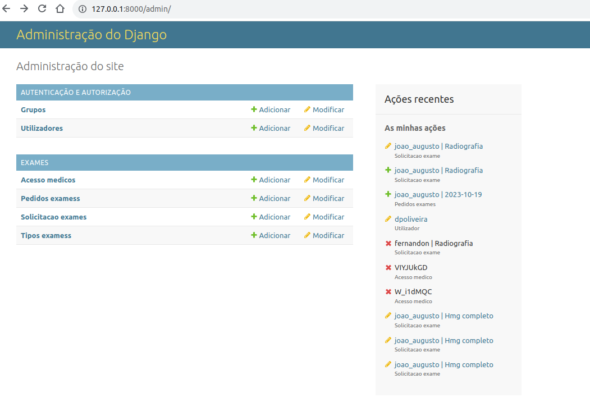
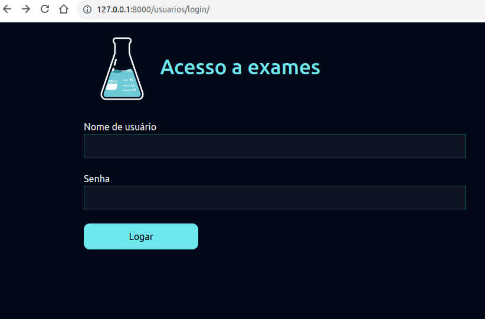
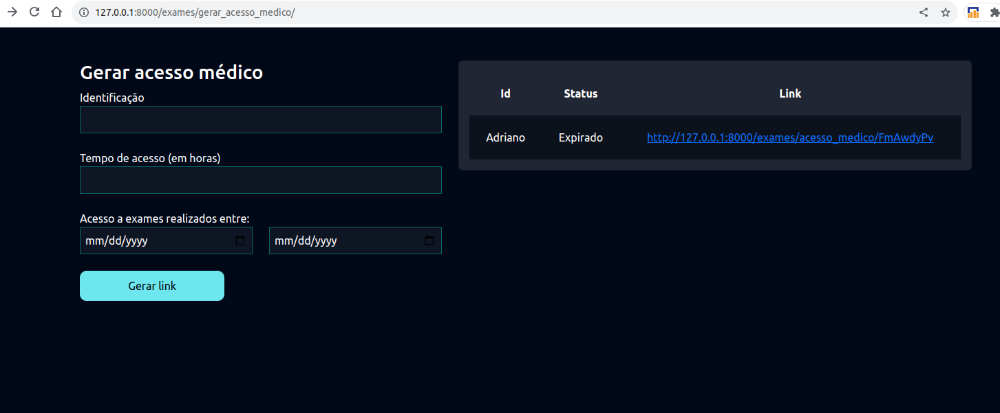
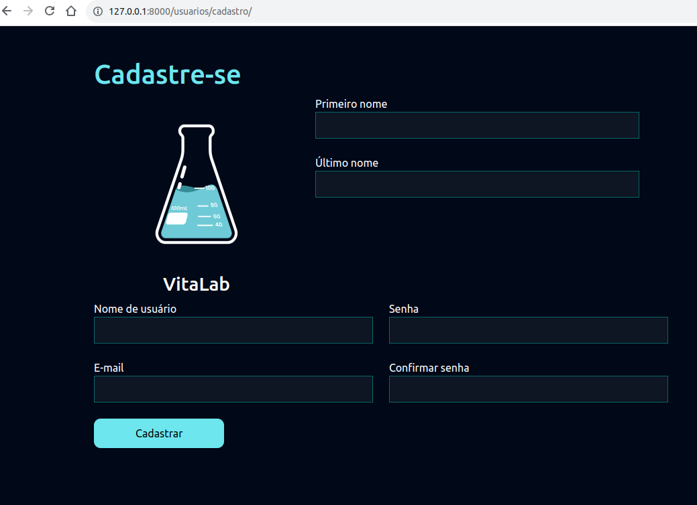
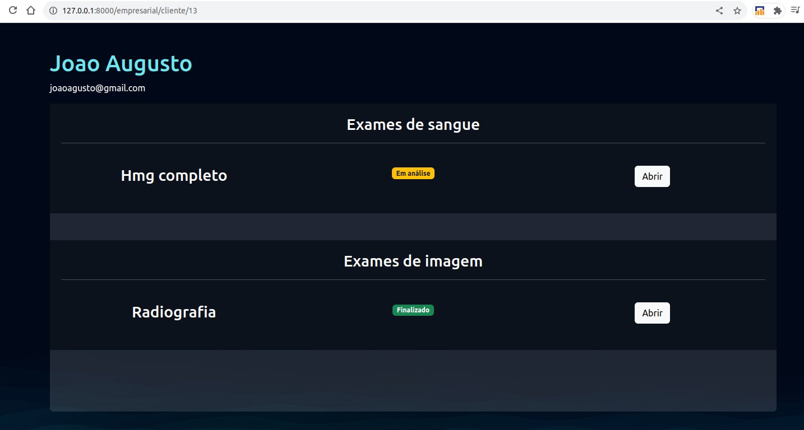
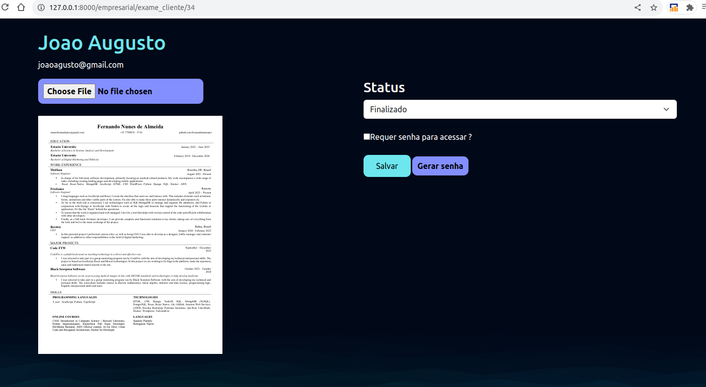
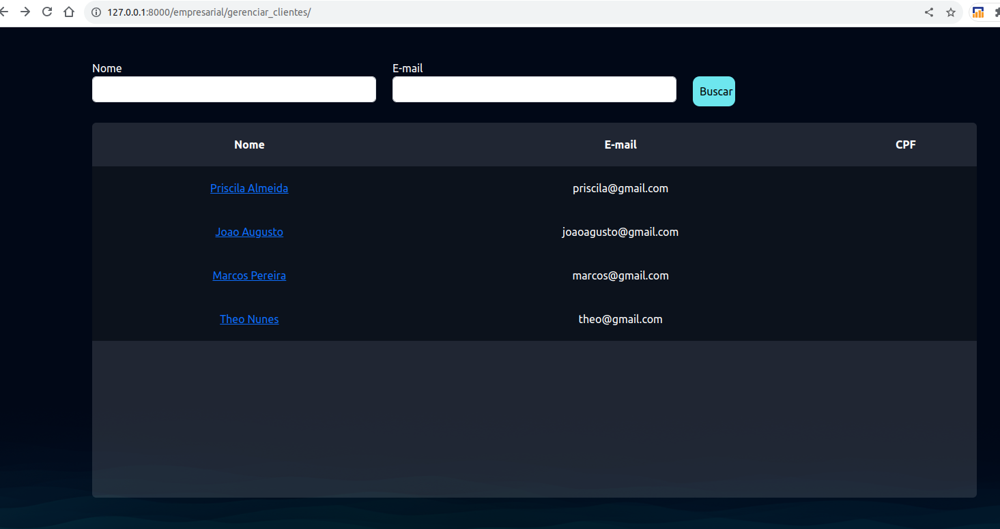
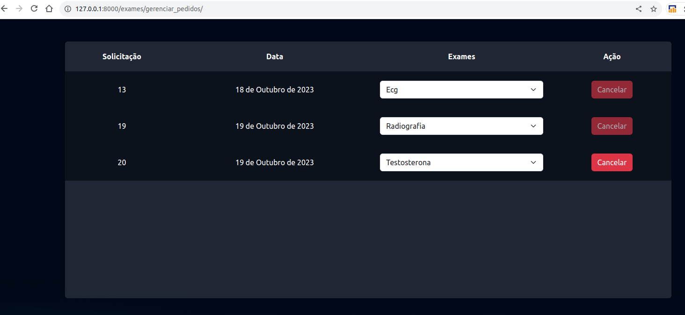
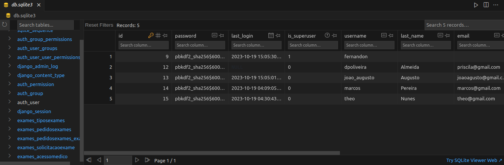

<h1 align="center"> Lab Program </h1>

    This is a project developed in Python/Django where I created the interface for a laboratory page. It contains: a registration and login page, access to test requests and results and also a login system for administrators with control of patients, doctors and tests.

  <a href="#-tecnology">Tecnology</a>&nbsp;&nbsp;&nbsp;|&nbsp;&nbsp;&nbsp;
  <a href="#-project">Project</a>&nbsp;&nbsp;&nbsp;|&nbsp;&nbsp;&nbsp;
  <a href="#-layout">Layout</a>&nbsp;&nbsp;&nbsp;|&nbsp;&nbsp;&nbsp;
  <a href="#memo-license">License</a>

  

 

## 🚀 Tecnology

This project was developed with the following technologies:

- Python
- Django
- SQLite3/Db Browser
- HTML and CSS
- Git and Github
- Deploy with Pythonanywhere

## Layout

## License

This project is under the MIT license.

---

Developed by Fernando Nunes
